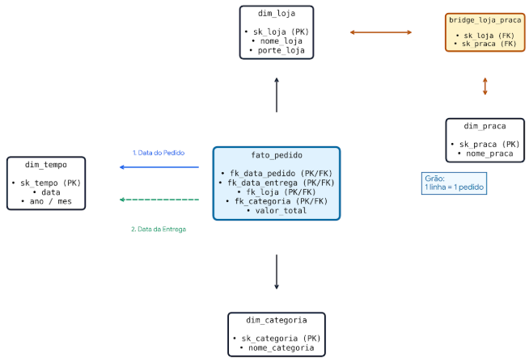

# Pet Shop Pata Amiga - Modelagem Dimensional e Análise de Vendas (SQL)

##  Contexto do Projeto
A Pata Amiga é uma rede catarinense de pet shops com 32 lojas. Este projeto consolida 7 meses de dados (4.044 pedidos) provenientes de três sistemas legados em um modelo dimensional (Star Schema) para responder a 5 perguntas estratégicas de negócio.

---

##  Diagrama do Modelo Dimensional (Star Schema)

> **Grão da Fato (`fato_pedido`):** 1 linha = 1 pedido (Total: 4.044 linhas).

---

##  Tarefa 1: Diagnóstico da Base de Origem
- **Grafias de Loja:** Múltiplas variações com erros ortográficos, acentos, sufixos (/SC) e apelidos.
- **Grafias de Categoria:** 18 grafias distintas na origem reduzidas a 7 categorias padronizadas.
- **Pedidos sem Código de Loja:** 1.575 pedidos (~39%).
- **Pedidos sem Nome de Loja:** 3 pedidos (vinculados à linha -1 "Nao Informado").
- **Marcos de Processo em Branco:**
  - Separação: 1.077
  - Nota Fiscal: 1.338
  - Despacho: 1.665
  - Entrega: 1.953 (pedidos ainda não concluídos)

---

##  Regras de Negócio e Tratamento (ETL)
1. **Datas:** Conversão da data do pedido (`MM/DD/AAAA HH:MI AM/PM`) via `STR_TO_DATE`. Marcos em formato `AAAA-MM-DD` convertidos com `DATE()`.
2. **Números e Valores:** Remoção de `R$`, pontos de milhar e substituição de textos vazios/`-` por `NULL`.
3. **De-Para de Categoria:** Aplicação de regra condicional com prioridade estrita (`MED` > `PETISC` > `RA` > `HIG` > `BRINQ` > `ACESS` > `SERV`).
4. **Padronização de Lojas:** Remoção do sufixo `/SC`, espaços duplos e correção de 3 casos críticos (`BLUMENAL` -> `BLUMENAU`, `FLORIPA` -> `FLORIANOPOLIS`, `JGUA` -> `JARAGUA`).
5. **Canais e Desconto:** Resolução da precedência `WHATS` antes de `APP`.
6. **Rateio por Praça:** Aplicação do `fator_publico` via `bridge_loja_praca` para garantir a integridade do faturamento.

---

## Ordem de Execução dos Scripts
1. `01-carga-staging.sql` - Criação e carga das tabelas brutas.
2. `02-dimensoes-prontas.sql` - Criação e carga de `dim_tempo` e `dim_loja`.
3. `03-dimensoes-e-ponte.sql` - Criação de `dim_categoria`, `dim_praca` e `bridge_loja_praca` (com inserção do registro `-1`).
4. `04-carga-fato.sql` - População da `fato_pedido` com 4.044 registros.
5. `05-perguntas-de-negocio.sql` - Consultas de análise e validação dos totais.

---

##  Respostas às Perguntas de Negócio

### P1: Gargalo da Entrega
- **Tempo Médio Total:** 10,46 dias (geral da rede)..
- **Intervalo Mais Lento:** Nota Despacho, que consome em média 8,53 dias nas lojas de pequeno porte e 3,33 dias nas demais.
- **Comportamento por Porte:**Lojas de porte Grande (8,04 dias) e Média (8,06 dias) mantêm ciclos operacionais praticamente idênticos. O gargalo operacional reside integralmente nas lojas de porte Pequena, cujo ciclo total atinge 15,27 dias devido a atrasos críticos na etapa de despacho (8,53 dias vs. 3,34 dias no porte médio).

### P2: Concentração de Faturamento por Categoria
| Categoria | Faturamento (R$) | % do Total |
| :--- | :--- | :--- |
| Racoes | R$ 21.239.566,21 | 62,78% |
| Medicamentos | R$ 5.059.118,76 | 14,95% |
| Outros | R$ 4.630.184,66 | 13,69% |
| Higiene e Beleza | R$ 1.212.824,89 | 3,58% |
| Acessorios | R$ 1.166.136,38 | 3,45% |
| Brinquedos | R$ 525.478,24 | 1,55% |
| **Total Geral** | **R$ 33.833.309,14** | **100,00%** |

##  Insights e Diagnóstico de Negócio

* **Dominância de Rações:** A categoria representa **62,78%** do faturamento total (R$ 21.239.566,21), consolidando-se como o principal motor de receita e produto de atração da rede.
---
### P3: Desconto por Canal de Venda
## 📊 Tabela de Desconto por Canal de Venda

| Canal | Ticket Médio COM Desconto | Ticket Médio SEM Desconto | % do Faturamento | Faturamento Total (R$) |
| :--- | :--- | :--- | :--- | :--- |
| App | R$ 8.900,45 | R$ 2.771,98 | 29,28% | R$ 9.905.205,96 |
| Site | R$ 8.534,73 | R$ 5.318,58 | 25,74% | R$ 8.709.746,34 |
| Loja Fisica | R$ 11.253,72 | R$ 2.706,47 | 22,94% | R$ 7.761.846,93 |
| WhatsApp | R$ 9.385,73 | R$ 3.965,83 | 10,33% | R$ 3.493.441,19 |
| Nao Informado | R$ 11.015,53 | R$ 3.986,02 | 6,65% | R$ 2.250.505,39 |
| Telefone | R$ 8.489,62 | R$ 987,55 | 5,06% | R$ 1.712.563,33 |
| **Total Geral** | — | — | **100,00%** | **R$ 33.833.309,14** |

##  Insights Negócio

* **Participação dos Canais Digitais:** O **App** lidera o faturamento com **29,28%** (R$ 9.905.205,96), seguido pelo **Site** com **25,74%** (R$ 8.709.746,34). Juntos, os dois canais digitais representam mais de **55%** da receita da rede.
* **Impacto do Desconto no Ticket Médio:** Em todos os canais, pedidos com desconto registrado apresentam um ticket médio muito mais elevado. Na **Loja Física**, o ticket médio salta de R$ 2.706,47 (sem desconto) para **R$ 11.253,72** (com desconto).
* **Canal WhatsApp:** Responsável por **10,33%** do faturamento (R$ 3.493.441,19), o WhatsApp apresenta ticket médio de R$ 9.385,73 para vendas com desconto vs. R$ 3.965,83 sem desconto.
---

### P4: Faturamento Rateado por Praça de Atendimento
---

##  Tabela de Faturamento Rateado por Praça de Atendimento

| Praça de Atendimento | Regional | Faturamento Rateado (R$) | % do Total Rateado |
| :--- | :--- | :--- | :--- |
| Vale do Itajai | Regional Leste | R$ 12.056.870,24 | 35,65% |
| Grande Florianopolis | Regional Leste | R$ 4.884.885,19 | 14,44% |
| Norte Industrial | Regional Norte | R$ 3.344.104,40 | 9,89% |
| Litoral Sul | Regional Sul | R$ 2.777.683,70 | 8,21% |
| Litoral Norte | Regional Norte | R$ 2.669.554,90 | 7,89% |
| Serra Catarinense | Regional Oeste | R$ 1.870.979,81 | 5,53% |
| Carbonifera | Regional Sul | R$ 1.782.391,94 | 5,27% |
| Extremo Oeste | Regional Oeste | R$ 1.425.003,43 | 4,21% |
| Meio-Oeste | Regional Oeste | R$ 1.002.414,54 | 2,96% |
| Foz do Itajai | Regional Leste | R$ 817.764,79 | 2,42% |
| Planalto Serrano | Regional Oeste | R$ 676.218,20 | 2,00% |
| Planalto Norte | Regional Norte | R$ 512.421,22 | 1,52% |
| **Subtotal Praças** | **—** | **R$ 33.820.292,36** | **100,00%** |
| Pedidos sem Loja (Não Informado / Linha -1) | — | R$ 13.016,78 | — |
| **Total Geral Reconciliado** | **—** | **R$ 33.833.309,14** | **—** |

## Consolidação por Regional

| Regional | Faturamento Rateado (R$) | % do Total Rateado |
| :--- | :--- | :--- |
| Regional Leste | R$ 17.759.520,22 | 52,51% |
| Regional Norte | R$ 6.526.080,52 | 19,30% |
| Regional Oeste | R$ 4.974.615,98 | 14,71% |
| Regional Sul | R$ 4.560.075,64 | 13,48% |
### P5: Expansão e Limitações dos Dados
- **a) Ranking por Vendas/1k Habs:** 
##  P5 (a): Ranking por Vendas / 1k Habitantes e Tempo de Entrega

A métrica de **itens por 1.000 habitantes** avalia a densidade de consumo relativa à população da cidade. Nota-se uma forte correlação positiva (**r = +0,736**) entre a taxa de itens por mil habitantes e o tempo médio de entrega. 

Cidades de menor porte populacional (ex: Rio dos Cedros, Presidente Getúlio, Ibirama) apresentam os maiores índices por habitante (acima de 30 itens/1k hab), porém sofrem com os maiores prazos de entrega (14 a 16 dias) devido ao gargalo logístico das lojas de pequeno porte. Em contrapartida, grandes centros (Florianópolis, Joinville, Chapecó) possuem baixas taxas relativas (2,6 a 3,5 itens/1k hab) com entregas mais céleres (~8 dias).

### Tabela: Ranking Top 10 e Flop 5 (Itens / 1k Habs vs. Tempo Médio de Entrega)

| Posição | Loja / Cidade | Itens Vendidos | População | Itens / 1k Habs | Média Dias Entrega |
| :--- | :--- | :--- | :--- | :--- | :--- |
| 1º | Pata Amiga Rio dos Cedros | 474 | 11.322 | 41.87 | 14.31 dias |
| 2º | Pata Amiga Presidente Getulio | 570 | 16.359 | 34.84 | 14.26 dias |
| 3º | Pata Amiga Ibirama | 597 | 18.613 | 32.07 | 15.50 dias |
| 4º | Pata Amiga Itapoa | 534 | 20.586 | 25.94 | 15.53 dias |
| 5º | Pata Amiga Santo Amaro da Imperatriz | 530 | 22.357 | 23.71 | 16.00 dias |
| 6º | Pata Amiga Taio | 352 | 18.173 | 19.37 | 14.63 dias |
| 7º | Pata Amiga Timbo | 804 | 45.011 | 17.86 | 7.77 dias |
| 8º | Pata Amiga Gaspar | 1.189 | 71.133 | 16.72 | 8.10 dias |
| 9º | Pata Amiga Otacilio Costa | 289 | 18.227 | 15.86 | 15.72 dias |
| 10º | Pata Amiga Ituporanga | 354 | 25.748 | 13.75 | 16.63 dias |
|

---
**b) Análise por Faixa de Franquia:** ## 🏬 P5 (b): Análise por Faixa de Franquia e Limitação Histórica (SCD Tipo 1)

### Tabela: Desempenho por Faixa de Franquia

| Faixa de Franquia | Qtd. Lojas | Faturamento Total (R$) | % do Faturamento |
| :--- | :--- | :--- | :--- |
| Ouro | 15 | R$ 18.998.028,89 | 56,17% |
| Diamante | 5 | R$ 7.397.722,97 | 21,87% |
| Prata | 8 | R$ 5.467.415,53 | 16,17% |
| Bronze | 4 | R$ 1.957.124,97 | 5,79% |
| **Total Geral** | **32** | **R$ 33.820.292,36** | **100,00%** |

> **Limitação Técnica de Negócio (SCD Tipo 1 / Foto Atual):**
> A dimensão de lojas (`dim_loja`) armazena a `faixa_franquia` atual de forma destrutiva (Slowly Changing Dimension Tipo 1). Caso uma loja tenha progredido da faixa *Bronze* para *Prata* ou *Ouro* durante o período analisado (7 meses), todo o seu faturamento histórico é reatribuído integralmente à faixa atual. Essa modelagem impede a realização de análises retroativas sobre a evolução de desempenho por categoria de franquia ao longo do tempo.

---

 **c) O que ficou de fora:** A análise identificou pontos cego na base de origem que impactam o diagnóstico completo:

| Métrica / Limitação | Registros Afetados | Impacto no Diagnóstico |
| :--- | :--- | :--- |
| **Pedidos sem Código/Nome de Loja** | 3 pedidos (R$ 13.016,78) | Registros vinculados à linha fictícia -1 ("Não Informado") |
| **Entregas não Concluídas** | 1.953 pedidos (48,3%) | Impedem a medição do ciclo total de entrega para quase metade da base |
| **Itens em Branco** | 257 registros | Prejudicam a contagem e análise de volume físico de produtos |
| **Valores em Branco** | 121 registros | Requerem imputação ou descarte na consolidação financeira |

##  Recomendação Final para Expansão da Rede

Com base nos dados cruzados de **faturamento por praça (P4)**, **população** e **densidade de atendimento (P5a)**:

1. **Prioridade de Expansão — Florianópolis / São José (Grande Florianópolis):** 
   - A região de Florianópolis e São José concentra mais de 780 mil habitantes, porém apresenta uma taxa reduzida de itens por habitante (2,65 a 3,71 itens/1k hab). A demanda reprimida e o alto poder aquisitivo justificam a abertura de uma nova unidade de médio/grande porte na **Grande Florianópolis** para capturar *market share*.
2. **Reestruturação Logística nas Lojas Pequenas:** 
   - Antes de expandir para cidades pequenas (onde o custo logístico eleva o prazo de entrega para mais de 15 dias), deve-se resolver o gargalo de despacho observado nas lojas de pequeno porte.

---

##  Vídeo de Apresentação
[Assista ao vídeo no Google Drive](https://drive.google.com/file/d/1U03sNBhuIJWd10Zwp-V6durshhD0Dq7W/view?usp=sharing_AQUI)